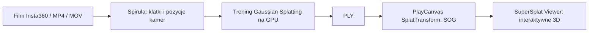

# AI Evolution 360 Studio
### Z filmu do przestrzeni. Lokalnie. Open source.

**Nagraj miejsce kamerą Insta360. Zamień footage w interaktywną wizualizację 3D.**

[](LICENSE)


AI Evolution 360 Studio łączy nagranie wideo, rekonstrukcję Gaussian Splatting i podgląd 3D w jednym prostym interfejsie. Dodajesz film, wybierasz jakość, obserwujesz przetwarzanie, a potem rozglądasz się po odtworzonej przestrzeni i eksportujesz scenę.

Projekt **AI Evolution Polska** dla twórców i pasjonatów cyfrowego odwzorowania miejsc. Zaprojektowany z myślą o materiałach z kamer **Insta360 X4/X5**, panoramach 360° oraz zwykłych filmach MP4/MOV.

> **Status uczciwie:** pełna ścieżka od syntetycznego MP4 do interaktywnej sceny została sprawdzona na Windows z RTX 3070. Sprawdzono również jeden rzeczywisty INSV z dwiema soczewkami (57 s); nie oznacza to pełnej zgodności ze wszystkimi trybami X4/X5. Obsługa INSV, jakość modelu i czas pracy zależą od materiału, kodeka, wersji silnika oraz GPU. To wersja eksperymentalna.


## Co potrafi?

- **Przeciągnij i upuść film** — MP4, MOV lub INSV, do 20 GB.
- **Trzy poziomy jakości** — szybki test, standard i większy budżet rekonstrukcji.
- **Wizualizacja generowania** — fioletowo-niebieskie orbity, punkty i skanowanie materiału, rzeczywiste etapy, czas i licznik treningu.
- **Interaktywny podgląd 3D** — obracanie, przybliżanie, swobodna nawigacja i pełny ekran.
- **Eksport SOG i Gaussian Splat PLY** do zgodnych narzędzi.
- **Biblioteka projektów**, archiwizacja, anulowanie, ponowienie i logi.
- **Instrukcja nagrywania** w aplikacji.
- **Lokalne przetwarzanie** — nagrania nie trafiają do chmury. Instalacja pobiera zależności z internetu.


Animacja sygnalizuje działanie procesu; nie pokazuje rosnącej geometrii. Procent pochodzi z licznika treningu i nie oznacza postępu całego zadania. Model 3D pojawia się po eksporcie.

## Jak to działa?



Integrujemy [Spirula Studio](https://github.com/harry7557558/spirula-studio), [SplatTransform](https://github.com/playcanvas/splat-transform) i [SuperSplat Viewer](https://github.com/playcanvas/supersplat-viewer). Naszą warstwą są interfejs, organizacja projektów i obsługa procesu. Dziękujemy autorom tych projektów.

## Instalacja — Windows

Wymagania: Windows 10/11 x64, **Node.js 22+ z npm**, **Git**, **FFmpeg i ffprobe w PATH**, aktualne sterowniki GPU obsługujące Vulkan. Testowano na RTX 3070 8 GB, Ryzen 7 5800X i 32 GB RAM. Wymagania minimalne nie zostały wyznaczone; zapewnij miejsce na film, klatki i checkpointy.

```powershell
git clone https://github.com/aievolutionpl/ai-evolution-360-studio.git
cd ai-evolution-360-studio
./scripts/Setup-Studio.ps1
./START-STUDIO.cmd
```

Skrypt pobiera przypięte oficjalne zależności i buduje moduły PlayCanvas. Pierwsza instalacja wymaga internetu. [Instalacja ręczna i szczegóły →](docs/INSTALL.md)

Otwórz **http://127.0.0.1:8765/**. Zatrzymaj serwer przez `STOP-STUDIO.cmd`. Zamknięcie karty nie zatrzymuje obliczeń.

## Pierwsza scena

1. Nagraj 20–60 sekund spokojnego spaceru wokół obiektu lub przez jeden pokój.
2. Dodaj film i sprawdź typ kamery.
3. Zacznij od **Szybkiego testu**.
4. Obserwuj etapy. W razie potrzeby anuluj i spróbuj ponownie.
5. Obejrzyj wynik i pobierz SOG lub PLY.

**Dobry materiał ma znaczenie:** kamera powinna zmieniać pozycję, a kolejne klatki zawierać wspólne szczegóły. Sam obrót w jednym punkcie nie wystarczy. Nagrywaj powoli, ostro i przy równym świetle; unikaj ruchomych ludzi, szkła, luster oraz dużych pustych powierzchni.

Dla INSV wymagane są dwie ścieżki wideo w jednym pliku. Jeśli kamera zapisuje osobne pliki lub format nie daje się odczytać, zszyj materiał w Insta360 Studio do pełnej panoramy **equirectangular 2:1**, np. 3840 × 1920, i wybierz „Panorama 360°”. Bez reframingu, napisów, cięć ani przyspieszania.

[Pełna instrukcja nagrywania i obsługi →](docs/USER_GUIDE.md)

## Dane i ograniczenia

Projekty zapisują się w `workspace/projects`. Upload tworzy lokalną kopię filmu. Kolejne próby zachowują pliki robocze; archiwizacja nie zwalnia dysku. Jednocześnie działa jeden proces GPU. Stare próby pozostają na dysku, ale UI pokazuje bieżący wynik.

To aplikacja lokalna, bez kont, chmury, publicznego hostingu ani instalatora Electron. Nie wystawiaj serwera do internetu. Wyniki mogą mieć artefakty i ubytki — nie są modelem pomiarowym. Aplikacja tworzy scenę 3D, a nie gotowy film reklamowy. Repozytorium nie zawiera filmów użytkownika, wytrenowanych modeli ani binariów silnika.

## Rozwój i testy

```powershell
npm test
node --check services/server.mjs
```

Testy jednostkowe nie wymagają GPU. Pełny test wymaga instalacji i materiału. Generator syntetycznego filmu: `scripts/create-reference-fixture.py` (Python, numpy, Pillow, FFmpeg). Kontrole `scripts/check-api.mjs` wymagają serwera i gotowego projektu QA; tworzą archiwizowany projekt testowy.

[Architektura](docs/INTEGRATION_PLAN.md) · [Współtworzenie](CONTRIBUTING.md) · [Bezpieczeństwo](SECURITY.md) · [Zależności](THIRD_PARTY_NOTICES.md)

## Licencja

Kod integracji udostępniamy na **GPL-3.0-only** — możesz go używać, analizować, modyfikować i rozwijać zgodnie z [licencją](LICENSE). Zależności zachowują własne licencje. Insta360 jest znakiem towarowym jego właściciela; projekt nie jest oficjalnym produktem ani partnerstwem Insta360.

---

**English:** An experimental local video-to-3D studio by AI Evolution Polska. Designed for Insta360 footage, stitched 360° panoramas and conventional video. Powered by Spirula Studio for reconstruction and PlayCanvas for conversion and viewing. Includes upload, progress visualization, projects and SOG/PLY export. Windows-focused; synthetic-video end-to-end testing completed, one real dual-fisheye INSV verified; broader X4/X5 compatibility pending. GPL-3.0-only.

## Zdjęcia 360° (v0.3)

Wybierz **Zdjęcia 360°** i dodaj jednocześnie jeden lub kilka plików INSP/JPG/PNG.
Eksportuj pełną, zszytą panoramę **equirectangular 2:1** z Insta360 Studio
(np. 7680 × 3840). Możesz też dodać bezpośrednio INSP z dwoma obiektywami obok siebie. Studio rozdziela obiektywy do rekonstrukcji, bez zszywania danych treningowych. Podgląd INSP to przybliżona projekcja sferyczna bez kalibracji producenta; szew i horyzont mogą być niedokładne. Nie mieszaj INSP i zszytych JPG/PNG w jednym zestawie.

- **1–2 zdjęcia:** interaktywny podgląd panoram, obracanie i przybliżanie. To podgląd sferyczny, bez odtworzonej głębi.
- **3 lub więcej:** rekonstrukcja wspólnej przestrzeni przez Spirula SfM i Gaussian Splatting. Zalecamy **12–30 zdjęć** z różnych pozycji, ze wspólnymi detalami. Wynik można wyeksportować jako SOG lub PLY.
- Przesuwaj kamerę o około 30–80 cm. Zachowuj nieruchomą scenę i stałe światło. Dodaj zdjęcia pośrednie w drzwiach i korytarzach; niepowiązane pomieszczenia nie połączą się automatycznie.
- Limit: **100 zdjęć, 100 MB na zdjęcie, 5 GB na zestaw**. Całość pozostaje lokalna.
- Zestaw jest zatwierdzany dopiero po odczytaniu wszystkich plików. Rekonstrukcja wymaga rejestracji wszystkich dodanych panoram; częściowy wynik daje komunikat o brakujących połączeniach.

Podgląd panoram korzysta z Pannellum 2.5.6 (MIT), instalowanego przez `scripts/Setup-Studio.ps1`.
Test end-to-end obejmuje syntetyczny pokój z 12 panoramami: upload, SfM 12/12,
trening 3000 kroków, eksport SOG i lokalny podgląd. Jakość rzeczywistych zdjęć zależy
od ostrości, paralaksy i wspólnych szczegółów; nie jest gwarantowana.
Generator zestawu testowego: `python scripts/create-panorama-fixture.py` (NumPy, Pillow).

## Czyszczenie mgiełki i luźnych splatów (v0.3.1)

W gotowym projekcie otwórz **Czystsza przestrzeń**. Wybierz Delikatne, Standard
lub Mocne i kliknij **Wyczyść scenę**. Nie trzeba ponownie trenować modelu.
Filtr usuwa splaty o niskiej nieprzezroczystości i splaty bez istotnego wkładu
w zajęte woksele (`splat-transform --filter-floaters`). Siła reguluje progi;
nie jest to rozmycie obrazu ani generowanie brakujących powierzchni.

Czyszczenie zawsze korzysta z oryginalnego PLY, tworzy osobne pliki PLY/SOG,
i zachowuje ustawienia kamer. Przyciski **Oryginał / Po czyszczeniu** pozwalają
porównać oba warianty z tej samej początkowej pozycji. Pobierany PLY/SOG odpowiada
wybranemu wariantowi. Kolejna próba ponownie filtruje oryginał, więc usuwanie się
nie kumuluje. Anulowanie, błąd lub przerwanie aplikacji zachowuje poprzedni wynik.

Zacznij od delikatnego filtra. Mocniejszy może usuwać szkło, cienkie elementy,
liście i prawidłowe półprzezroczyste detale; przejrzyj kilka pozycji kamery.
Widoczne artefakty o wysokiej nieprzezroczystości mogą pozostać — automatyczny
filtr nie zna prawdziwego wyglądu miejsca. W takich przypadkach potrzebne jest
ręczne zaznaczanie w edytorze splatów albo lepszy materiał referencyjny.
Operacja korzysta z lokalnego GPU, ma limit czasu i nie nadpisuje oryginału.


### Bezpośredni import INSP (v0.3.2)

Testowano oryginalne INSP 11904 × 5952 z kamery Insta360: oba pliki
są kopiowane bez zmiany bajtów i odczytywane jako dwa obiektywy, a nie panorama 2:1.
Rekonstrukcja używa osobnych obrazów cam0/cam1, modelu thin-prism-fisheye i rigu
dual-fisheye. Początkowa ogniskowa jest przybliżonym założeniem szerokokątnym,
potem optymalizowanym przez silnik; nie jest odczytaną kalibracją producenta.

Pojedyncze zdjęcie i zestaw dwóch mają podgląd sferyczny. Potrzeba minimum 3
różnych pozycji do uruchomienia 3D, zalecamy 12–30. W rzeczywistym teście
dwa odległe ujęcia z poruszającymi się osobami nie dały wiarygodnej geometrii.
Wyższy preset nie zastąpi brakujących ujęć. Przybliżony podgląd INSP może mieć
widoczny szew i pochylenie; do wiernego, skalibrowanego podglądu eksportuj JPG 2:1
z Insta360 Studio. Oryginalne INSP pozostają lokalnie i są zachowane.


## Filmy w High Quality i eksport do Blendera (v0.4)

Nowy projekt domyślnie wybiera **High Quality**: do 400 klatek na tor, próbkowanie
do około 3 klatek/s, bok 2048 px, 30 000 kroków treningu i do miliona splatów.
SfM i trening używają poziomu high; trening ma jawny dzielnik rozdzielczości 1.
Podgląd startuje z pełną jakością renderowania. Możesz ręcznie włączyć tryb
płynniejszego podglądu lub wybrać Szybki test. Wyższe ustawienia kosztują więcej
czasu i pamięci GPU; nie naprawią rozmytego filmu, braku paralaksy ani ruchu osób.
Istniejące sceny nie są automatycznie przeliczane: użyj „Przelicz z inną jakością”.
Generacja i eksport wymagają co najmniej 5 GB wolnego miejsca na dysku projektu;
to próg wstępny, a nie gwarantowany limit zużycia dla długiego materiału.

W gotowym projekcie wybierz **Przenieś do Blendera → Przygotuj GLB**. Silnik
wydobywa siatkę trójkątów z aktualnego wariantu modelu (także po czyszczeniu),
usuwa drobne odizolowane komponenty i zapisuje kolory wierzchołków. Eksport
tekstury UV nie jest włączony: natywny atlas UV powodował błąd na dużej scenie.
GLB jest standardowym glTF 2.0 mesh, nie rozszerzeniem Gaussian Splatting.
Blender: **File → Import → glTF 2.0 (.glb/.gltf)**. Do oglądania kolorów włącz
Material Preview. Obiekt i jego wierzchołki możesz edytować w Edit Mode; wybrane
fragmenty oddzielisz poleceniem Separate → Selection. To eksport całej sceny,
a nie automatyczna segmentacja mebli. Zapisz projekt jako .blend.

Eksport jest oddzielnym zadaniem z możliwością anulowania i nie zmienia SOG/PLY.
Zmiana wariantu wymaga nowego GLB; interfejs nie proponuje starego modelu jako
eksportu nowej sceny. Mesh może mieć ubytki, nierówną topologię i inne odbicia niż
splaty. Wymaga ręcznej kontroli; nie gwarantuje skali pomiarowej ani szczelności
siatki do druku 3D. Oryginalny eksport PLY nadal służy narzędziom Gaussian Splat.

## Środowisko do Smart Concept Designer (v0.5)

Eksport jest zgodny z importem na
[Smart Concept Designer](https://aievolutionpl.github.io/smart-concept-designer/).
Ten edytor Three.js wczytuje samowystarczalne GLB do 30 MiB i projekty JSON
wersji 1 z osadzonymi własnymi modelami. Nie renderuje SOG ani Gaussian Splat PLY.

1. W Studio otwórz gotową scenę i wybierz wariant (oryginał lub po czyszczeniu).
2. W sekcji **Środowisko do projektowania** podaj dłuższy bok całego skanu
   (2–60 m). Domyślne 20 m jest przykładem; rekonstrukcja nie zna pewnej skali.
3. Wybierz **Przygotuj środowisko**. Studio użyje zgodnej siatki GLB lub
   najpierw utworzy ją z wybranego wariantu splatów. Pracę możesz anulować.
4. Pobierz **projekt .forma.json**. W Designerze zapisz dotychczasową kompozycję,
   wybierz **Otwórz** i ten plik. Skan pojawi się na pustej działce, gotowy do
   zestawienia z modelami z biblioteki.
5. Alternatywnie pobierz **environment GLB** i użyj **Dodaj własny model**.
   Następnie kliknij + przy modelu w bibliotece, aby umieścić go w scenie.

Eksport centruje siatkę w X/Z, wyrównuje najniższy punkt do Y=0 i ustawia
proporcjonalną skalę. Uproszczenie celuje w 250 tys. trójkątów z ograniczonym
błędem geometrii; wynik zależy od topologii. Jeśli plik nadal przekracza 30 MiB,
aplikacja zgłosi błąd zamiast udostępniać niezgodny eksport. Kolory wierzchołków
korzystają z `KHR_materials_unlit`, ponieważ zawierają już światło z nagrania.
Zmiana słońca w Designerze nie przelicza oświetlenia zapisanego w skanie.

To **model referencyjny otoczenia**, nie natywne edytowalne elementy Customer
Garden: pozostaje jednym obiektem w zakładce Scena. Nie tworzy kolizji,
automatycznego podłoża pod meble ani segmentacji ścian i wyposażenia.
Przycisk Environment Edit w Designerze dotyczy jego wbudowanego ogrodu.
Ubytki i artefakty rekonstrukcji pozostają widoczne; eksport nie naprawia
brakujących powierzchni. Po imporcie sprawdź skalę względem znanego wymiaru.

Przetwarzanie i pliki pozostają lokalnie; importer Designera zapisuje je
w przeglądarce. Sam import nie publikuje skanu na GitHub Pages dla innych osób.
Eksporty przechowywane są w `workspace/projects/<id>/environment/`.
Po aktualizacji istniejącej instalacji uruchom `npm ci` i ponownie Studio.
