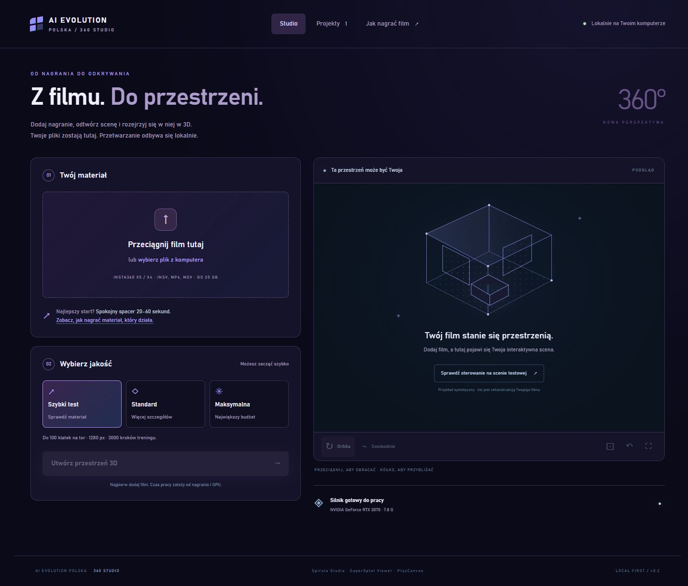
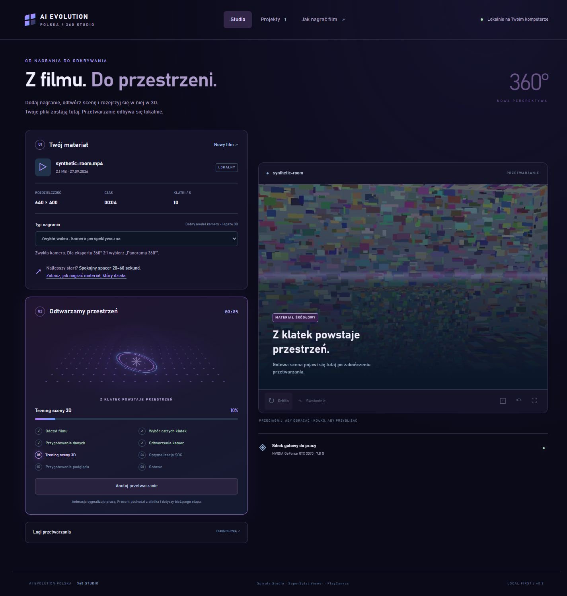
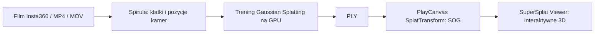

# AI Evolution 360 Studio
### Z filmu do przestrzeni. Lokalnie. Open source.

**Nagraj miejsce kamerą Insta360. Zamień footage w interaktywną wizualizację 3D.**

[](LICENSE)


AI Evolution 360 Studio łączy nagranie wideo, rekonstrukcję Gaussian Splatting i podgląd 3D w jednym prostym interfejsie. Dodajesz film, wybierasz jakość, obserwujesz przetwarzanie, a potem rozglądasz się po odtworzonej przestrzeni i eksportujesz scenę.

Projekt **AI Evolution Polska** dla twórców i pasjonatów cyfrowego odwzorowania miejsc. Zaprojektowany z myślą o materiałach z kamer **Insta360 X4/X5**, panoramach 360° oraz zwykłych filmach MP4/MOV.

> **Status uczciwie:** pełna ścieżka od syntetycznego MP4 do interaktywnej sceny została sprawdzona na Windows z RTX 3070. Sprawdzono również jeden rzeczywisty INSV z dwiema soczewkami (57 s); nie oznacza to pełnej zgodności ze wszystkimi trybami X4/X5. Obsługa INSV, jakość modelu i czas pracy zależą od materiału, kodeka, wersji silnika oraz GPU. To wersja eksperymentalna.



## Co potrafi?

- **Przeciągnij i upuść film** — MP4, MOV lub INSV, do 20 GB.
- **Trzy poziomy jakości** — szybki test, standard i większy budżet rekonstrukcji.
- **Wizualizacja generowania** — fioletowo-niebieskie orbity, punkty i skanowanie materiału, rzeczywiste etapy, czas i licznik treningu.
- **Interaktywny podgląd 3D** — obracanie, przybliżanie, swobodna nawigacja i pełny ekran.
- **Eksport SOG i Gaussian Splat PLY** do zgodnych narzędzi.
- **Biblioteka projektów**, archiwizacja, anulowanie, ponowienie i logi.
- **Instrukcja nagrywania** w aplikacji.
- **Lokalne przetwarzanie** — nagrania nie trafiają do chmury. Instalacja pobiera zależności z internetu.



Animacja sygnalizuje działanie procesu; nie pokazuje rosnącej geometrii. Procent pochodzi z licznika treningu i nie oznacza postępu całego zadania. Model 3D pojawia się po eksporcie.

## Jak to działa?



Integrujemy [Spirula Studio](https://github.com/harry7557558/spirula-studio), [SplatTransform](https://github.com/playcanvas/splat-transform) i [SuperSplat Viewer](https://github.com/playcanvas/supersplat-viewer). Naszą warstwą są interfejs, organizacja projektów i obsługa procesu. Dziękujemy autorom tych projektów.

## Instalacja — Windows

Wymagania: Windows 10/11 x64, **Node.js 22+ z npm**, **Git**, **FFmpeg i ffprobe w PATH**, aktualne sterowniki GPU obsługujące Vulkan. Testowano na RTX 3070 8 GB, Ryzen 7 5800X i 32 GB RAM. Wymagania minimalne nie zostały wyznaczone; zapewnij miejsce na film, klatki i checkpointy.

```powershell
git clone https://github.com/aievolutionpl/ai-evolution-360-studio.git
cd ai-evolution-360-studio
./scripts/Setup-Studio.ps1
./START-STUDIO.cmd
```

Skrypt pobiera przypięte oficjalne zależności i buduje moduły PlayCanvas. Pierwsza instalacja wymaga internetu. [Instalacja ręczna i szczegóły →](docs/INSTALL.md)

Otwórz **http://127.0.0.1:8765/**. Zatrzymaj serwer przez `STOP-STUDIO.cmd`. Zamknięcie karty nie zatrzymuje obliczeń.

## Pierwsza scena

1. Nagraj 20–60 sekund spokojnego spaceru wokół obiektu lub przez jeden pokój.
2. Dodaj film i sprawdź typ kamery.
3. Zacznij od **Szybkiego testu**.
4. Obserwuj etapy. W razie potrzeby anuluj i spróbuj ponownie.
5. Obejrzyj wynik i pobierz SOG lub PLY.

**Dobry materiał ma znaczenie:** kamera powinna zmieniać pozycję, a kolejne klatki zawierać wspólne szczegóły. Sam obrót w jednym punkcie nie wystarczy. Nagrywaj powoli, ostro i przy równym świetle; unikaj ruchomych ludzi, szkła, luster oraz dużych pustych powierzchni.

Dla INSV wymagane są dwie ścieżki wideo w jednym pliku. Jeśli kamera zapisuje osobne pliki lub format nie daje się odczytać, zszyj materiał w Insta360 Studio do pełnej panoramy **equirectangular 2:1**, np. 3840 × 1920, i wybierz „Panorama 360°”. Bez reframingu, napisów, cięć ani przyspieszania.

[Pełna instrukcja nagrywania i obsługi →](docs/USER_GUIDE.md)

## Dane i ograniczenia

Projekty zapisują się w `workspace/projects`. Upload tworzy lokalną kopię filmu. Kolejne próby zachowują pliki robocze; archiwizacja nie zwalnia dysku. Jednocześnie działa jeden proces GPU. Stare próby pozostają na dysku, ale UI pokazuje bieżący wynik.

To aplikacja lokalna, bez kont, chmury, publicznego hostingu ani instalatora Electron. Nie wystawiaj serwera do internetu. Wyniki mogą mieć artefakty i ubytki — nie są modelem pomiarowym. Aplikacja tworzy scenę 3D, a nie gotowy film reklamowy. Repozytorium nie zawiera filmów użytkownika, wytrenowanych modeli ani binariów silnika.

## Rozwój i testy

```powershell
npm test
node --check services/server.mjs
```

Testy jednostkowe nie wymagają GPU. Pełny test wymaga instalacji i materiału. Generator syntetycznego filmu: `scripts/create-reference-fixture.py` (Python, numpy, Pillow, FFmpeg). Kontrole `scripts/check-api.mjs` wymagają serwera i gotowego projektu QA; tworzą archiwizowany projekt testowy.

[Architektura](docs/INTEGRATION_PLAN.md) · [Współtworzenie](CONTRIBUTING.md) · [Bezpieczeństwo](SECURITY.md) · [Zależności](THIRD_PARTY_NOTICES.md)

## Licencja

Kod integracji udostępniamy na **GPL-3.0-only** — możesz go używać, analizować, modyfikować i rozwijać zgodnie z [licencją](LICENSE). Zależności zachowują własne licencje. Insta360 jest znakiem towarowym jego właściciela; projekt nie jest oficjalnym produktem ani partnerstwem Insta360.

---

**English:** An experimental local video-to-3D studio by AI Evolution Polska. Designed for Insta360 footage, stitched 360° panoramas and conventional video. Powered by Spirula Studio for reconstruction and PlayCanvas for conversion and viewing. Includes upload, progress visualization, projects and SOG/PLY export. Windows-focused; synthetic-video end-to-end testing completed, one real dual-fisheye INSV verified; broader X4/X5 compatibility pending. GPL-3.0-only.

## Zdjęcia 360° (v0.3)

Wybierz **Zdjęcia 360°** i dodaj jednocześnie jeden lub kilka plików JPG/PNG.
Eksportuj pełną, zszytą panoramę **equirectangular 2:1** z Insta360 Studio
(np. 7680 × 3840). Surowe INSP oraz obrazy dwóch kół fisheye wymagają wcześniejszego eksportu.

- **1–2 zdjęcia:** interaktywny podgląd panoram, obracanie i przybliżanie. To podgląd sferyczny, bez odtworzonej głębi.
- **3 lub więcej:** rekonstrukcja wspólnej przestrzeni przez Spirula SfM i Gaussian Splatting. Zalecamy **12–30 zdjęć** z różnych pozycji, ze wspólnymi detalami. Wynik można wyeksportować jako SOG lub PLY.
- Przesuwaj kamerę o około 30–80 cm. Zachowuj nieruchomą scenę i stałe światło. Dodaj zdjęcia pośrednie w drzwiach i korytarzach; niepowiązane pomieszczenia nie połączą się automatycznie.
- Limit: **100 zdjęć, 100 MB na zdjęcie, 5 GB na zestaw**. Całość pozostaje lokalna.
- Zestaw jest zatwierdzany dopiero po odczytaniu wszystkich plików. Rekonstrukcja wymaga rejestracji wszystkich dodanych panoram; częściowy wynik daje komunikat o brakujących połączeniach.

Podgląd panoram korzysta z Pannellum 2.5.6 (MIT), instalowanego przez `scripts/Setup-Studio.ps1`.
Test end-to-end obejmuje syntetyczny pokój z 12 panoramami: upload, SfM 12/12,
trening 3000 kroków, eksport SOG i lokalny podgląd. Jakość rzeczywistych zdjęć zależy
od ostrości, paralaksy i wspólnych szczegółów; nie jest gwarantowana.
Generator zestawu testowego: `python scripts/create-panorama-fixture.py` (NumPy, Pillow).
