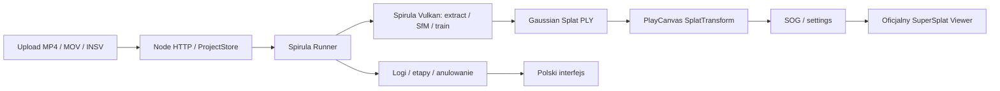

# AI Evolution 360 Studio — architektura v0.2

Stan 27.09.2026: wdrożona lokalna aplikacja przeglądarkowa z polskim interfejsem. Electron pozostaje opcją na przyszłość. Oryginalnych silników rekonstrukcji i renderowania nie zastępujemy własnymi.

| Plik lub katalog | Odpowiedzialność |
|---|---|
| apps/desktop | Interfejs, upload, biblioteka, przewodnik, osadzony viewer |
| services/server.mjs | API, walidacja materiału, kolejność etapów, eksport, zasoby |
| services/project-manager | Atomic JSON, projekty, odzyskiwanie po restarcie |
| services/spirula-runner | Proces bez shella, logi UTF-8, timeout, anulowanie |
| vendor | Przypięte oryginalne repozytoria |
| toolchain | Lokalne binaria i build Vulkan |
| workspace/projects | Źródła, numerowane próby, modele i logi |

Serwer słucha na 127.0.0.1:8765, sprawdza Host i Origin oraz wymaga losowego tokenu dla mutacji. Upload strumieniuje na dysk, limit wynosi 20 GB. Jednocześnie działa jeden job GPU. Anulowanie zatrzymuje własne drzewo procesu przez taskkill. Po restarcie niedokończone zadanie otrzymuje stan interrupted.

Każda próba ma osobne dataset/N, reconstruction/N, splat/N i web/N oraz logs/N.log. Poprzednie wyniki pozostają na dysku; rozpoczęcie nowej próby usuwa bieżący wskaźnik wyniku z UI. Selektor dawnych wersji nie jest wdrożony.

Preset szybki: 100 klatek, 1280 px, 3000 kroków, limit 150 tys. splatów. Standard: 180 / 1600 / 10000 / 400 tys. Maksymalny: 300 / 1920 / 20000 / 800 tys. Są to limity aplikacji, nie gwarancje liczby klatek czy jakości. Animacja obejmuje czas pracy; procent pokazujemy tylko dla rozpoznanego licznika treningu, bez fikcyjnego globalnego postępu.

Obsługiwane modele kamery: perspective, equirectangular i dual-fisheye (dwa strumienie w jednym INSV). Pliki rozdzielone należy wcześniej zszyć do panoramy 2:1. Automatyczne wykrywanie panoramy korzysta z metadanych, dlatego eksport bez nich wymaga ręcznego wyboru.

Poza zakresem v0.2: instalator, chmura, konta użytkowników, publiczne udostępnianie, pomiary, VR, segmentacja, edycja splatów. Test rzeczywistych X5/X4 pozostaje otwarty; obecny pełny test używa syntetycznego wideo.
